# Networking Tracker

A private, per-user networking tracker for the people you want to stay connected with at Berkeley. Sign up, add the people you meet — name, company, role, where you met, notes, and a priority — then sort, filter, edit, and delete them. Every contact belongs to exactly one account, and that ownership is enforced by **Row Level Security inside Postgres** rather than by application code, so the data stays private even against a request made directly to the public Data API with a valid login.

**Live app:** **https://networking-tracker-gules.vercel.app**

**Repository:** https://github.com/BuildingBrian/networking-tracker

---

## Table of contents

- [Screenshots](#screenshots)
- [Features](#features)
- [Technology stack and why](#technology-stack-and-why)
- [Architecture](#architecture)
- [Request flow](#request-flow)
- [Local setup](#local-setup)
- [Environment variables](#environment-variables)
- [Database schema](#database-schema)
- [Authentication and RLS ownership](#authentication-and-rls-ownership)
- [Tests](#tests)
- [Grading evidence](#grading-evidence)
- [Production verification](#production-verification)
- [Deployment](#deployment)
- [Known limitations and what I'd improve next](#known-limitations-and-what-id-improve-next)

---

## Screenshots

All captures are produced by one script against a running instance, so they can be regenerated at any time:

```bash
npm run screenshots                                   # against http://localhost:3000
BASE_URL=https://<your-app>.vercel.app npm run screenshots
```

`scripts/screenshots.mjs` drives the locally installed Google Chrome with Playwright, creates a throwaway account, and walks the entire lifecycle.

| | |
| --- | --- |
| **Sign in** — email + password via Neon Managed Better Auth.<br>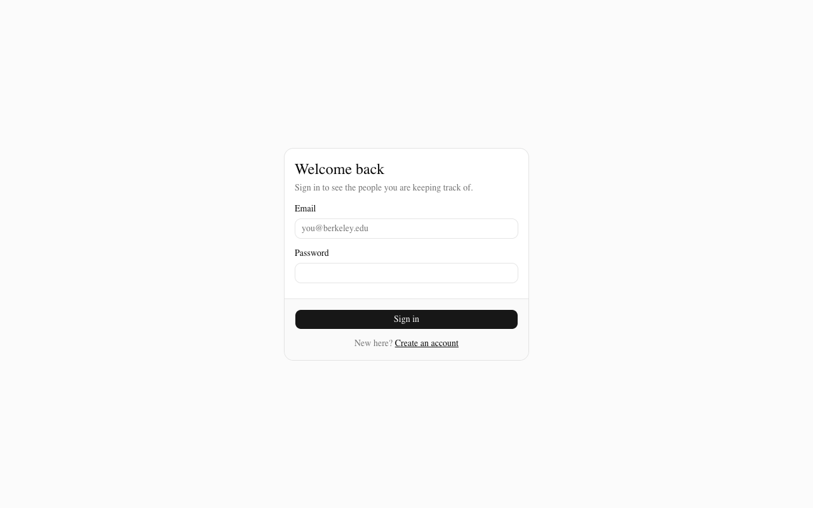 | **Sign up**<br>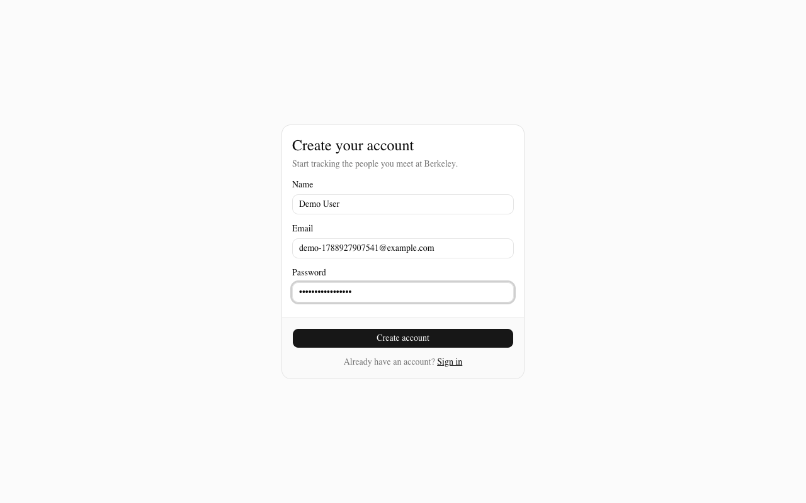 |
| **Empty state** — a new account sees a clear call to action, not a blank table.<br>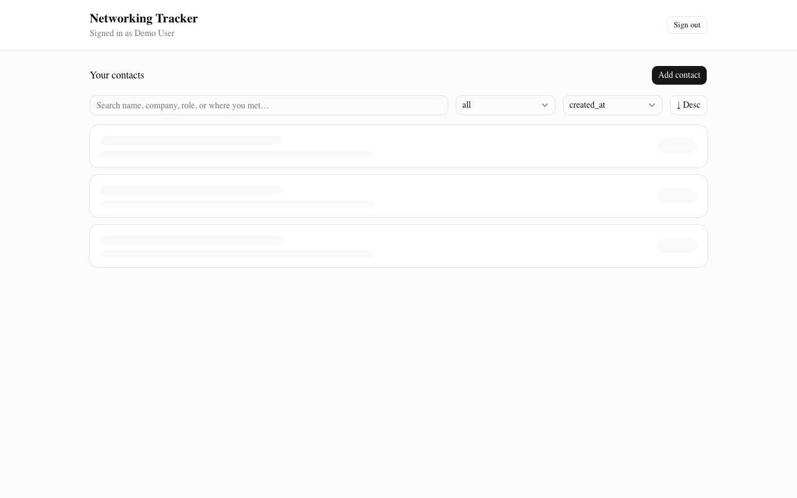 | **Contact list** — sortable table on desktop, priority badges, success toast after adding.<br>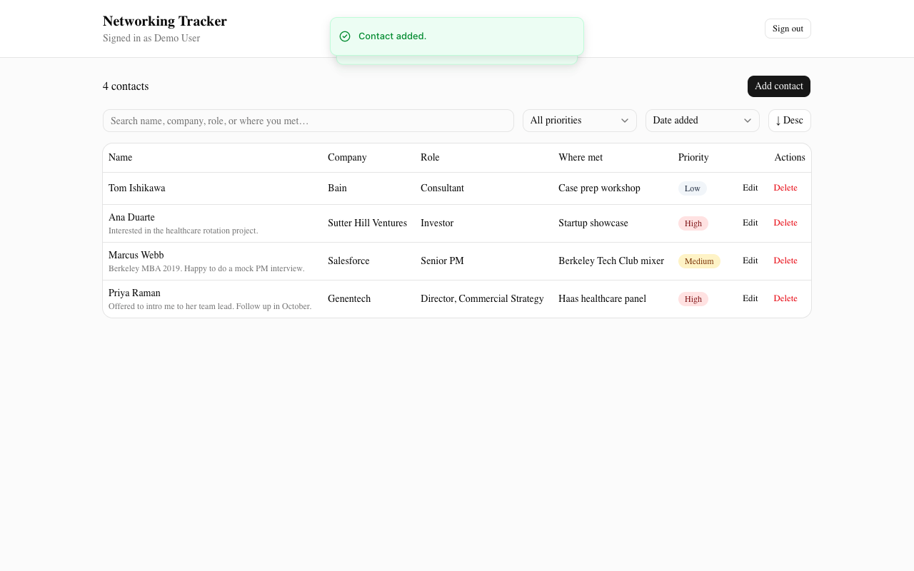 |
| **Invalid input fails safely** — a blank name is rejected by the server with a `400`; the message appears both inline and as a toast.<br>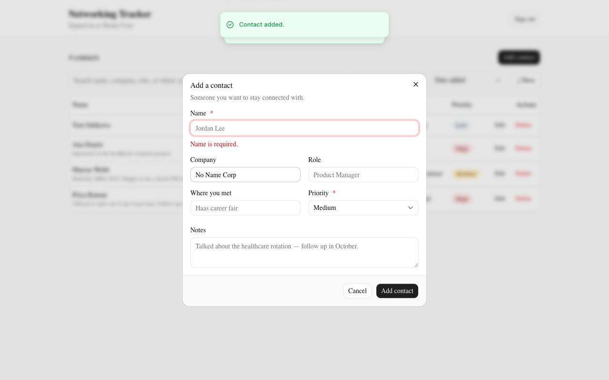 | **Filtering** — only `high` priority contacts shown.<br>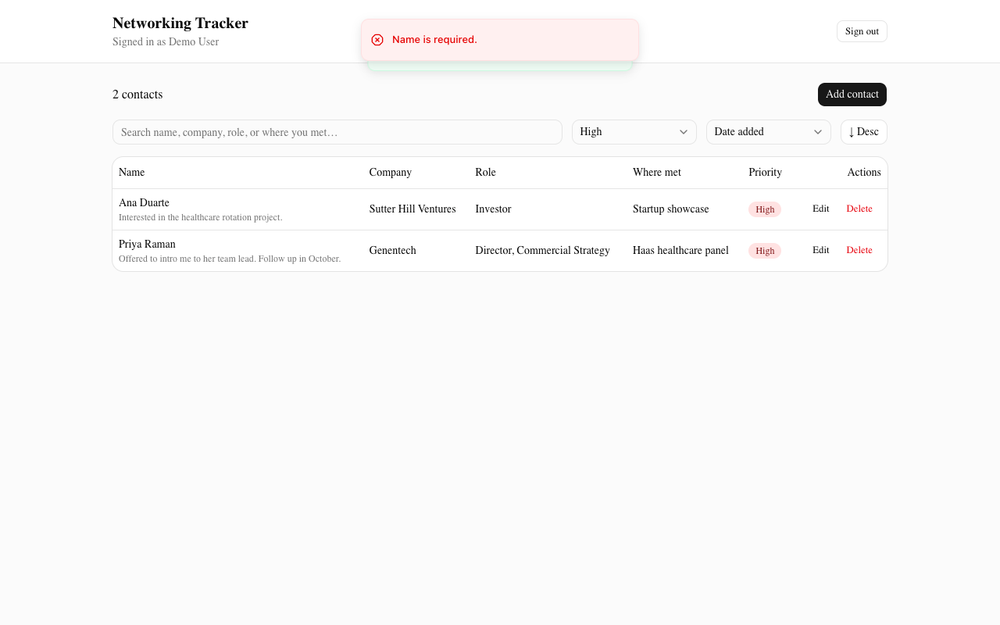 |
| **Editing** — the same dialog, pre-filled.<br>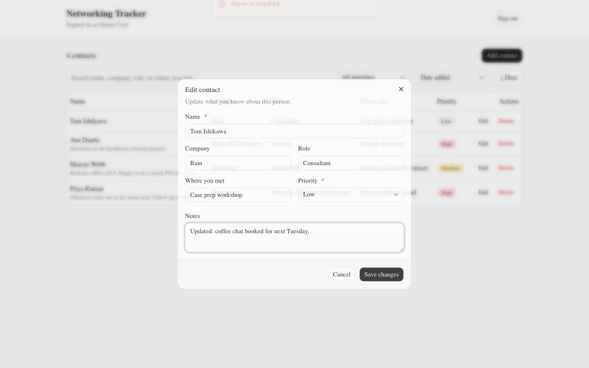 | **Survives a refresh** — a full page reload; the data is in Postgres, not browser state.<br>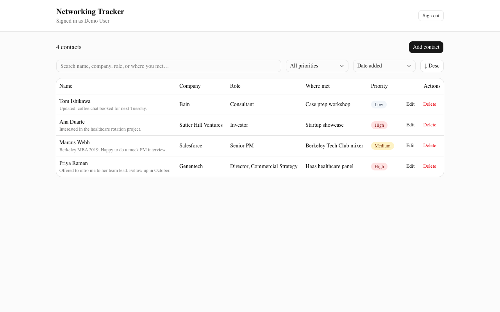 |
| **Mobile** — stacked cards and single-column controls at 390 px.<br>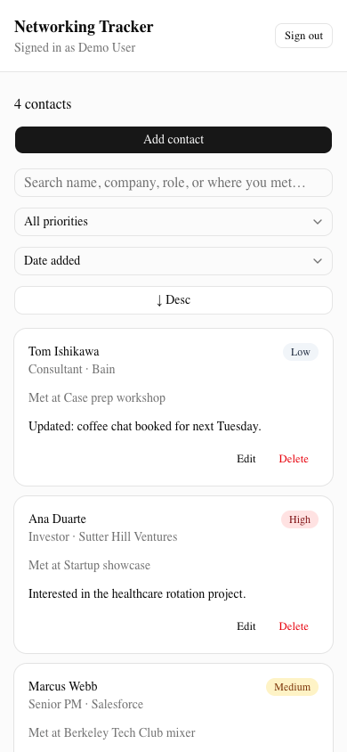 | **Deleting** — confirmed, then gone.<br>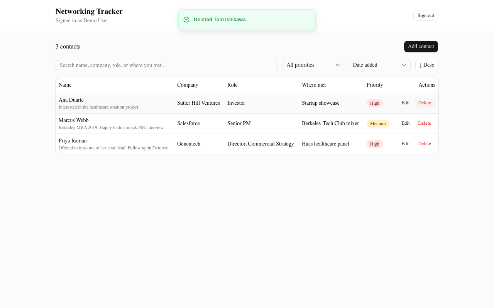 |
| **Sign out** — lands back on the sign-in screen; `/contacts` is no longer reachable.<br>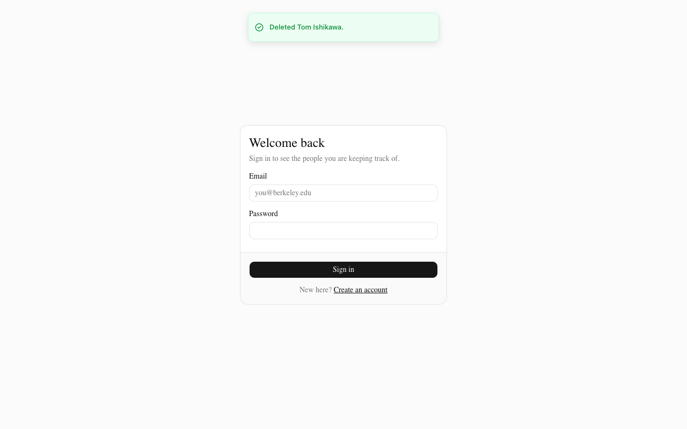 | |

---

## Features

- **Email + password sign-up, sign-in, and sign-out** via Neon Managed Better Auth, with the session held in an httpOnly signed cookie.
- **A private contact list per account.** You only ever see your own rows — enforced in the database, verified by tests.
- **Create, view, edit, and delete** contacts with name, company, role, where you met, notes, and priority.
- **Priority is constrained to `high` / `medium` / `low`** in three independent places: the UI `<Select>`, the server-side Zod schema, and a Postgres `CHECK` constraint.
- **Sort** by date added, name, company, or priority, ascending or descending. Priority sorts in meaningful order (high → medium → low), not alphabetically.
- **Filter** by priority and **search** across name, company, role, and where you met.
- **Understandable loading, empty, success, and error states**, including a distinct empty state for "no contacts yet" versus "no contacts match these filters", and a retry button on load failure.
- **Responsive**: a table on desktop, stacked cards on mobile, controls that reflow to a single column on small screens.
- **Data survives refresh** because it lives in Neon Postgres.

---

## Technology stack and why

| Layer | Choice | Why |
| --- | --- | --- |
| Framework | **Next.js 16 (App Router) + TypeScript** | Keeps the frontend and backend in one repo while staying genuinely separate — React client components in the browser, Route Handlers on the server. Also the deployment target Vercel is built around. |
| Styling | **Tailwind CSS v4 + shadcn/ui** | shadcn/ui is a real component system (Base UI primitives with consistent design tokens) rather than hand-rolled CSS, so the UI stays accessible and consistent across breakpoints with little custom code. |
| Database | **Neon Postgres** | Serverless Postgres that supports Row Level Security — which is where this app's security actually lives. |
| Auth | **Neon Managed Better Auth** | Issues a JWT whose subject Postgres reads as `auth.user_id()`. That is what makes database-level ownership possible without the app ever passing a user ID around. |
| Data access | **Neon Data API (PostgREST) via `@neondatabase/neon-js`** | Every request carries the signed-in user's own JWT, so RLS is evaluated on every query. The running app holds no privileged database connection. |
| Validation | **Zod** | One schema shared by the API routes and the test suite, so the tests exercise exactly the code the server runs. |
| Tests | **Vitest** | TypeScript-native; runs the pure validation tests and the live two-user RLS test from one command. |
| Hosting | **Vercel** | First-class Next.js support and simple production environment variables. |

---

## Architecture

```
Browser (React client components — src/components/*)
  │
  │  fetch('/api/contacts')              never talks to Postgres or the Data API
  ▼
Next.js Route Handlers (src/app/api/contacts/…)          ← the backend
  │  1. getSessionUser()   → 401 if not signed in
  │  2. Zod validation     → 400 with per-field messages
  │  3. exchange the session cookie for the user's JWT
  │  4. Data API call carrying THAT JWT
  ▼
Neon Data API (PostgREST)
  │
  ▼
Neon Postgres — Row Level Security decides which rows the query may touch
```

**Frontend** — `src/components/*` are client components. They hold UI state (filters, sort, dialogs) and talk only to this app's own `/api` routes. They never see a database credential.

**Backend** — `src/app/api/contacts/route.ts` (list, create) and `src/app/api/contacts/[id]/route.ts` (update, delete) are the server. Each handler authenticates the session, validates the body against a Zod schema, and only then issues a Data API query. `src/app/api/auth/[...path]/route.ts` proxies Neon Auth so the session lands in an **httpOnly, signed cookie** rather than browser-readable storage. `src/middleware.ts` redirects unauthenticated visits to `/contacts` to the sign-in page.

**Database** — `db/schema.sql` defines the `contacts` table, its `CHECK` constraints, an `updated_at` trigger, and four RLS policies. `npm run db:push` applies it and prints the resulting policies so you can verify them.

**Authentication** — Neon Managed Better Auth. The server never sends its own identity to the Data API; it exchanges the request's session cookie for the user's JWT (`src/lib/auth/server.ts → getDataApiToken`) and forwards that, so Postgres always evaluates policies *as that user*.

**Hosting** — Vercel. Server-only variables are Vercel environment variables and are never bundled into client JavaScript.

### Two layers of defence, on purpose

Validation exists in the **server** (Zod, with clear per-field messages) *and* in the **database** (`CHECK` constraints). Ownership is enforced **only** in the database, by RLS — the app deliberately does **not** add `WHERE user_id = me` to its queries, because doing so would hide whether RLS actually works. The test suite exploits exactly that: the two-user test bypasses this app's routes entirely and hits the public Data API directly.

---

## Request flow

Adding a contact, end to end:

1. The user submits the dialog form. The client `POST`s JSON to `/api/contacts`.
2. The handler calls `getSessionUser()`. No session → `401`, nothing else happens.
3. The body is parsed with `contactInputSchema`. A blank name or a priority outside `high|medium|low` → `400` with `{ error, fieldErrors }`, which the form renders under the offending input.
4. The handler builds a Data API client whose `getToken` exchanges **this request's** session cookie for the user's Neon Auth JWT.
5. `insert()` is sent **without** a `user_id`. Postgres fills it from `DEFAULT auth.user_id()`, and the `contacts_insert_own` policy's `WITH CHECK` confirms the row belongs to the caller.
6. The new row comes back and the list refetches.

Reading, updating, and deleting follow the same path. `PATCH /api/contacts/:id` filters on `id` alone — no `user_id` — because the `contacts_update_own` policy already restricts which rows the statement can see. Aiming it at another user's contact matches zero rows and returns `404`.

---

## Local setup

```bash
git clone https://github.com/BuildingBrian/networking-tracker.git
cd networking-tracker
npm install
```

**1. Create the Neon project** — either in the [Neon Console](https://console.neon.tech) (create a project → enable **Auth** → enable **Data API**) or with the CLI:

```bash
npm i -g neon@latest && neon login
neon neon-auth enable --project-id <id> --branch production
neon data-api  create --project-id <id> --branch production --database neondb
neon neon-auth domain allow-localhost enable --project-id <id> --branch production   # lets localhost sign in
```

**2. Configure the environment**

```bash
cp .env.example .env.local
openssl rand -base64 32        # → NEON_AUTH_COOKIE_SECRET
```

Fill in `.env.local` with the Auth URL, Data API URL, and pooled connection string from Neon (`neon connection-string production --project-id <id> --database-name neondb --role-name neondb_owner --pooled`).

**3. Apply the schema and RLS policies**

```bash
npm run db:push
```

This runs `db/schema.sql` over Neon's HTTP driver and then prints the RLS flags, every policy with its `USING` / `WITH CHECK` expression, and every column — so the security requirements are verifiable from the terminal.

**4. Run it**

```bash
npm run dev            # http://localhost:3000
```

Other commands:

```bash
npm test               # automated tests (see Tests)
npm run verify         # 16-step black-box check of a running instance (BASE_URL=… for production)
npm run screenshots    # regenerate docs/*.png against a running instance
npm run build          # production build
npm run lint
npm run typecheck
```

---

## Environment variables

Copy `.env.example` to `.env.local`. `.env.local` is git-ignored; `.env.example` contains placeholders only.

| Variable | Exposure | Purpose |
| --- | --- | --- |
| `NEXT_PUBLIC_NEON_AUTH_URL` | Public | Neon Auth HTTPS endpoint. Safe to expose — RLS, not URL secrecy, protects the data. |
| `NEXT_PUBLIC_NEON_DATA_API_URL` | Public | Neon Data API HTTPS endpoint. Same reasoning. |
| `NEON_AUTH_BASE_URL` | **Server only** | The Neon Auth instance the `/api/auth` proxy forwards to. |
| `NEON_AUTH_COOKIE_SECRET` | **Server only** | Signs the httpOnly session cookie. Minimum 32 characters. |
| `DATABASE_URL` | **Server only, local only** | Used *only* by `npm run db:push` from your machine. The running app never reads it and it is **not** set in Vercel. |

The Postgres connection string is never sent to the browser, never referenced by client code, never set on the host, and never committed. The application reaches the database exclusively through the Data API using the signed-in user's token.

---

## Database schema

`public.contacts` — [`db/schema.sql`](db/schema.sql) is the authoritative definition.

| Column | Type | Constraints |
| --- | --- | --- |
| `id` | `uuid` | Primary key, `default gen_random_uuid()`. |
| `user_id` | `text` | **`not null default auth.user_id()`** — the owner. Every RLS policy keys off this column. |
| `name` | `text` | `not null`; `CHECK (length(btrim(name)) > 0)`; `CHECK (length(name) <= 200)`. |
| `company` | `text` | Nullable. |
| `role` | `text` | Nullable. |
| `where_met` | `text` | Nullable. |
| `notes` | `text` | Nullable. |
| `priority` | `text` | `not null default 'medium'`; `CHECK (priority in ('high','medium','low'))`. |
| `priority_rank` | `int` | Generated always as (`high`→0, `medium`→1, `low`→2) so sorting by priority is meaningful, not alphabetical. |
| `created_at` | `timestamptz` | `not null default now()`. |
| `updated_at` | `timestamptz` | `not null default now()`; maintained by a `BEFORE UPDATE` trigger that also pins `user_id` to its previous value. |

Indexes: `(user_id, created_at desc)` and `(user_id, priority_rank)` — every query is scoped to one user, so `user_id` leads.

---

## Authentication and RLS ownership

When a user signs in, Neon Auth issues a JWT. Every Data API request carries that JWT, and Postgres exposes its subject as **`auth.user_id()`**. `contacts.user_id` defaults to that value, so the database — not the application — decides who owns a row.

RLS is **enabled and forced** on `contacts` (forced so it applies to the table owner too), with four separate policies:

```sql
create policy contacts_select_own on public.contacts
  for select to authenticated
  using (auth.user_id() = user_id);

create policy contacts_insert_own on public.contacts
  for insert to authenticated
  with check (auth.user_id() = user_id);

create policy contacts_update_own on public.contacts
  for update to authenticated
  using (auth.user_id() = user_id)
  with check (auth.user_id() = user_id);

create policy contacts_delete_own on public.contacts
  for delete to authenticated
  using (auth.user_id() = user_id);
```

**The ownership rule in one sentence:** a row is reachable only when `auth.user_id() = user_id`.

**Why `UPDATE` needs both clauses.** `USING` decides which rows a statement may *target*; `WITH CHECK` decides what those rows may look like *afterwards*. With `USING` alone, a user could edit a row they own and reassign `user_id` to someone else on the way out — handing their row to another account. `WITH CHECK` rejects any result that would no longer belong to the caller. The `BEFORE UPDATE` trigger additionally pins `user_id` to its old value, so even a future policy mistake could not silently transfer ownership.

The `anonymous` role is granted nothing on this table, so an unauthenticated request to the public Data API cannot read a single row.

`npm run db:push` prints what is actually in the database. Against the live project it reports:

```
RLS enabled: true   forced: true

4 policies on public.contacts:
  DELETE contacts_delete_own   USING (auth.user_id() = user_id)
  INSERT contacts_insert_own   WITH CHECK (auth.user_id() = user_id)
  SELECT contacts_select_own   USING (auth.user_id() = user_id)
  UPDATE contacts_update_own   USING (auth.user_id() = user_id)   WITH CHECK (auth.user_id() = user_id)

user_id   text   NOT NULL   default auth.user_id()
```

---

## Tests

```bash
npm test
```

Two suites, 25 tests.

**1. `tests/validation.test.ts` — 18 tests, no credentials required.** Runs against the same Zod schema the API routes use, so a pass here means the server rejects the same input the same way. Covers: empty names, whitespace-only names, missing names, over-length names, whitespace trimming, each valid priority, invalid priorities (`urgent`, `HIGH`), missing priorities, blank optional fields normalising to `null`, partial updates, and the exact error shape the API returns.

**2. `tests/rls.test.ts` — 7 tests, the two-account privacy proof.** Needs a configured `.env.local` *and* the app running (`npm run dev` in another terminal, or `TEST_APP_URL=https://…` for production); otherwise it skips with a message, so `npm test` passes on a fresh clone. It signs up two throwaway accounts through the app's own auth proxy to obtain each user's JWT, then runs every assertion **directly against the public Data API URL with that JWT — bypassing this app's route handlers entirely:**

- User A can read their own contact.
- User B cannot `SELECT` User A's contact, even by its exact ID.
- User A's contact does not appear in User B's unfiltered list.
- User B cannot `UPDATE` it — and A's copy is verified unchanged afterwards.
- User B cannot `DELETE` it — and the row still exists for A afterwards.
- User B cannot `INSERT` a row stamped with User A's `user_id`.
- User A cannot hand their own row to another user via `UPDATE`.

Because the suite talks to the public endpoint with each user's own token, nothing in the application's code can be what makes it pass. Only RLS can.

**3. `npm run verify` — a 16-step black-box check through the public HTTP surface** (`scripts/verify-production.mjs`). Point it at any running instance with `BASE_URL`. It creates one throwaway account and confirms: unauthenticated requests get `401` and the redirect to sign-in; blank name + invalid priority fail with per-field errors; create returns `201` with `user_id` stamped by the database; edit applies; an attempt to reassign `user_id` is ignored and the row stays owned by the caller; the priority filter works; delete returns `200` then `404`; and after sign-out the API refuses the request again. Exits non-zero on any failure, so it doubles as a post-deploy gate.

### Test output

`npm test` on 2026-09-08 against the live Neon project (`FORCE_COLOR=0 npx vitest run --reporter=verbose`, saved as [`docs/test-output.txt`](docs/test-output.txt)):

```
 ✓ tests/validation.test.ts > contact validation — name > rejects an empty name with a clear message
 ✓ tests/validation.test.ts > contact validation — name > rejects a name that is only whitespace
 ✓ tests/validation.test.ts > contact validation — name > rejects a missing name
 ✓ tests/validation.test.ts > contact validation — name > rejects a name longer than 200 characters
 ✓ tests/validation.test.ts > contact validation — name > trims surrounding whitespace from an otherwise valid name
 ✓ tests/validation.test.ts > contact validation — priority > accepts the valid priority "high"
 ✓ tests/validation.test.ts > contact validation — priority > accepts the valid priority "medium"
 ✓ tests/validation.test.ts > contact validation — priority > accepts the valid priority "low"
 ✓ tests/validation.test.ts > contact validation — priority > rejects a priority outside high / medium / low
 ✓ tests/validation.test.ts > contact validation — priority > rejects a priority in the wrong case
 ✓ tests/validation.test.ts > contact validation — priority > rejects a missing priority
 ✓ tests/validation.test.ts > contact validation — optional fields > accepts a contact with only a name and a priority
 ✓ tests/validation.test.ts > contact validation — optional fields > normalises blank optional fields to null rather than empty strings
 ✓ tests/validation.test.ts > contact validation — updates > accepts a partial update of a single field
 ✓ tests/validation.test.ts > contact validation — updates > still rejects an explicitly empty name on update
 ✓ tests/validation.test.ts > contact validation — updates > still rejects an invalid priority on update
 ✓ tests/validation.test.ts > contact validation — updates > rejects an empty update payload
 ✓ tests/validation.test.ts > validate() error shape > returns a human-readable top-level message the API can pass straight through
 ✓ tests/rls.test.ts > RLS: one user cannot reach another user's contacts > User A can read their own contact
 ✓ tests/rls.test.ts > RLS: one user cannot reach another user's contacts > User B cannot SELECT User A's contact, even by its exact ID
 ✓ tests/rls.test.ts > RLS: one user cannot reach another user's contacts > User B does not see User A's contact in an unfiltered list
 ✓ tests/rls.test.ts > RLS: one user cannot reach another user's contacts > User B cannot UPDATE User A's contact
 ✓ tests/rls.test.ts > RLS: one user cannot reach another user's contacts > User B cannot DELETE User A's contact
 ✓ tests/rls.test.ts > RLS: one user cannot reach another user's contacts > User B cannot INSERT a row owned by User A
 ✓ tests/rls.test.ts > RLS: one user cannot reach another user's contacts > User A cannot hand their own row to User B via UPDATE

 Test Files  2 passed (2)
      Tests  25 passed (25)
```

---

## Grading evidence

| Requirement | Where |
| --- | --- |
| Automated test output with passing validation tests | [Test output](#test-output) above; [`docs/test-output.txt`](docs/test-output.txt) |
| Sign-in and sign-out | [`docs/01-sign-in.png`](docs/01-sign-in.png), [`docs/02-sign-up-filled.png`](docs/02-sign-up-filled.png), [`docs/11-signed-out.png`](docs/11-signed-out.png) |
| Create, edit, delete, refresh a contact | [`04-contact-list`](docs/04-contact-list.png), [`07-edit-contact`](docs/07-edit-contact.png), [`10-after-delete`](docs/10-after-delete.png), [`08-persists-after-refresh`](docs/08-persists-after-refresh.png) |
| Two-account test: User A cannot access User B's contacts | The seven `tests/rls.test.ts` results in [Test output](#test-output), run against the public Data API with two real accounts |
| Invalid input failing safely | [`docs/05-invalid-input-rejected.png`](docs/05-invalid-input-rejected.png) — server `400`, inline + toast message |
| Schema and RLS ownership rule | [Database schema](#database-schema), [Authentication and RLS ownership](#authentication-and-rls-ownership), [`db/schema.sql`](db/schema.sql) |
| No committed secrets | `.env.local` is git-ignored and appears in no commit; `.env.example` holds placeholders only. Verified over the full history: `git log -p --all \| grep -cE 'npg_[A-Za-z0-9]{6,}'` (Neon passwords carry an `npg_` prefix), a search for the pooled database host, and a search for the cookie secret all return `0`. The only `postgresql://` in the repo is the placeholder in `.env.example`. |
| Mobile-friendly UI | [`docs/09-mobile-contact-list.png`](docs/09-mobile-contact-list.png) |
| Two-account test **repeated in production** | [Production verification](#production-verification) — 7/7 RLS tests against the live URL, output in [`docs/production-test-output.txt`](docs/production-test-output.txt) |
| Definition-of-Done checks **run against the live URL** | 16/16 in [`docs/production-verify-output.txt`](docs/production-verify-output.txt); full screenshot lifecycle in [`docs/production/`](docs/production/) |

---

## Production verification

Everything above was re-run against the deployed app, not just locally. Deployment `dpl_…ado1a7ss5` (built 2026-09-08 22:31 PDT from stored Vercel environment variables, nothing passed inline) is what `https://networking-tracker-gules.vercel.app` serves.

**Black-box lifecycle — `BASE_URL=https://networking-tracker-gules.vercel.app npm run verify`:**

```
Verifying https://networking-tracker-gules.vercel.app

✓ sign-in page renders  (HTTP 200)
✓ GET /api/contacts without a session → 401  (HTTP 401)
✓ /contacts without a session redirects to sign-in  (HTTP 307 → /auth/sign-in)
✓ sign-up succeeds and sets a session cookie  (HTTP 200, cookies: 2)
✓ new account starts with an empty list  (HTTP 200, 0 contacts)
✓ blank name + invalid priority → 400 with per-field errors  (HTTP 400: Name is required.)
✓ create → 201 with user_id stamped by the database  (HTTP 201, id f499ce1d-7168-4c3e-a1bc-549f603c6e2c)
✓ created contact appears in the list  (1 contacts)
✓ edit → 200 and the change is applied  (HTTP 200)
✓ attempt to reassign user_id is ignored; row stays owned by caller  (user_id unchanged)
✓ priority filter works (low → 1, high → 0)  (low 1, high 0)
✓ delete → 200  (HTTP 200)
✓ deleting it again → 404  (HTTP 404)
✓ list is empty again  (0 contacts)
✓ sign-out → 200  (HTTP 200)
✓ API refuses the request after sign-out → 401  (HTTP 401)

16 passed, 0 failed
```

**Two-account privacy test against production — `TEST_APP_URL=https://networking-tracker-gules.vercel.app npx vitest run tests/rls.test.ts`** (accounts created through the live app's auth proxy; every assertion sent straight to the public Data API with each user's JWT):

```
 ✓ tests/rls.test.ts > RLS: one user cannot reach another user's contacts > User A can read their own contact 1354ms
 ✓ tests/rls.test.ts > RLS: one user cannot reach another user's contacts > User B cannot SELECT User A's contact, even by its exact ID 374ms
 ✓ tests/rls.test.ts > RLS: one user cannot reach another user's contacts > User B does not see User A's contact in an unfiltered list 380ms
 ✓ tests/rls.test.ts > RLS: one user cannot reach another user's contacts > User B cannot UPDATE User A's contact 749ms
 ✓ tests/rls.test.ts > RLS: one user cannot reach another user's contacts > User B cannot DELETE User A's contact 740ms
 ✓ tests/rls.test.ts > RLS: one user cannot reach another user's contacts > User B cannot INSERT a row owned by User A 761ms
 ✓ tests/rls.test.ts > RLS: one user cannot reach another user's contacts > User A cannot hand their own row to User B via UPDATE 1884ms
 Test Files  1 passed (1)
      Tests  7 passed (7)
```

**Full screenshot lifecycle on production** — same script, `OUT_DIR=docs/production`: [sign-in](docs/production/01-sign-in.png) · [empty state](docs/production/03-empty-state.png) · [list](docs/production/04-contact-list.png) · [invalid input rejected](docs/production/05-invalid-input-rejected.png) · [filter](docs/production/06-filtered-high-priority.png) · [edit](docs/production/07-edit-contact.png) · [after refresh](docs/production/08-persists-after-refresh.png) · [mobile](docs/production/09-mobile-contact-list.png) · [after delete](docs/production/10-after-delete.png) · [signed out](docs/production/11-signed-out.png)


---

## Deployment

1. Push the repository to GitHub.
2. `vercel login`, then from the repo root `vercel link` (or import the repo in the Vercel dashboard).
3. Add the production environment variables — **Vercel → Settings → Environment Variables**, or:
   ```bash
   # The CLI refuses NEXT_PUBLIC_* values that look like credentials unless you
   # declare them public explicitly. These two are public by design — RLS, not
   # URL secrecy, protects the data.
   vercel env add NEXT_PUBLIC_NEON_AUTH_URL     production --type config --value "https://…/neondb/auth"
   vercel env add NEXT_PUBLIC_NEON_DATA_API_URL production --type config --value "https://…/neondb/rest/v1"

   # Server-only values: pipe them in so they never appear on a command line,
   # in shell history, or in `ps` output.
   printf '%s' "$NEON_AUTH_BASE_URL"      | vercel env add NEON_AUTH_BASE_URL      production --sensitive
   printf '%s' "$NEON_AUTH_COOKIE_SECRET" | vercel env add NEON_AUTH_COOKIE_SECRET production --sensitive
   ```
   `DATABASE_URL` is deliberately **not** added — the running app never uses it.
4. `vercel --prod`.
5. Add the deployed domain to Neon Auth's trusted origins so sign-in works there:
   ```bash
   neon neon-auth domain add https://<your-app>.vercel.app --project-id <id> --branch production
   ```
   For this deployment the public production domain `networking-tracker-gules.vercel.app` is registered. Vercel also generates a `<project>-<team>.vercel.app` alias, but Deployment Protection puts a Vercel login in front of it — so that one is deliberately *not* the URL in this README.
6. Open the public URL in a private window, create two accounts, and confirm neither can see the other's contacts. The same can be automated: `TEST_APP_URL=https://<your-app>.vercel.app npm test`.

---

## Known limitations and what I'd improve next

- **Email verification is off.** Sign-up accepts any syntactically valid address. For anything real, Neon Auth's email verification should be switched on.
- **Test runs leave throwaway accounts behind.** Each RLS run and screenshot run creates fresh `@example.com` users. Harmless, but a teardown via the Neon Auth admin API would keep the user table tidy.
- **Delete uses `window.confirm`.** Accessible and works, but a shadcn `AlertDialog` would match the rest of the UI.
- **Search is a `LIKE` scan.** Fine at the scale one person's network reaches; a `pg_trgm` index would be the fix if it ever grew large.
- **No pagination.** The list fetches every contact the user owns. Cursor pagination on `(created_at, id)` is the natural next step.
- **`@neondatabase/neon-js` is a beta SDK** (0.7.0-beta). Its `getAccessToken` helper 404s against Managed Better Auth today; this app calls the `token` endpoint directly, which is the documented JWT source, but the surface may shift between beta releases.
- **No optimistic UI.** Every mutation refetches the list. Fine at this size.
- **Tests cover validation and RLS, not the UI.** Playwright tests for sign-in → add → edit → delete would be the highest-value addition; the screenshot script is most of the way there.
